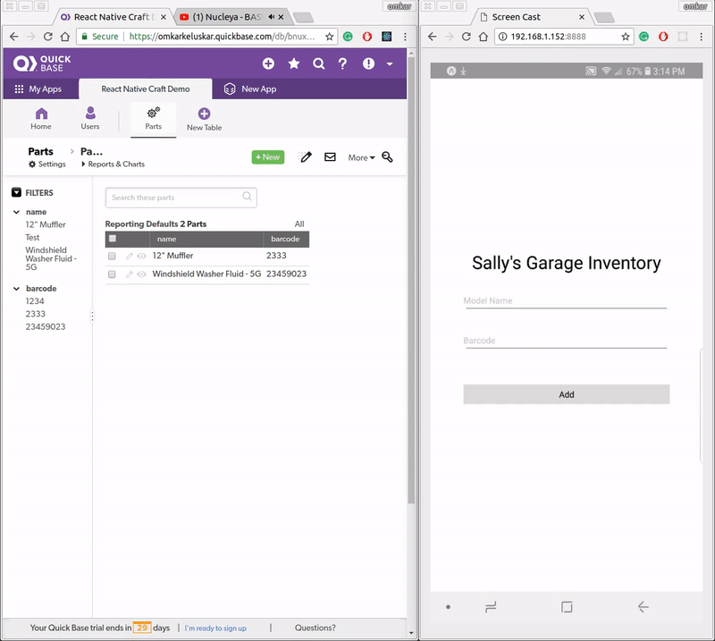

# react-native-craft
React Native app to add models to Quickbase Inventory


## Getting Started

1. Clone the repo
   ```bash
   git clone https://github.com/orkeluskar/react-native-craft.git
   ```
2. Change directory
   ```bash
   cd react-native-craft/
   ```
3. Create a `.env` file in root directory with `app_token` and `ticket` as variables
   - App Token can be found from [here](https://help.quickbase.com/user-assistance/app_tokens.html)
   - Auth ticket can be received by making a request to:
     ```
     https://target_domain/db/main?a=API_Authenticate&username=PTBarnum&password=TopSecret&hours=24
     ```
   - Once both of these are know, write them to the `.env` file:
     ```
     app_token=YOUR_APP_TOKEN_HERE
     ticket=YOUR_AUTH_TICKET_HERE
     ```
4. Install all the dependencies
   ```
   npm install
   ```
5. Start the server
   ```
   npm start
   ```
6. Visit the expo link from your phone which will be visible in the terminal


## Demo


